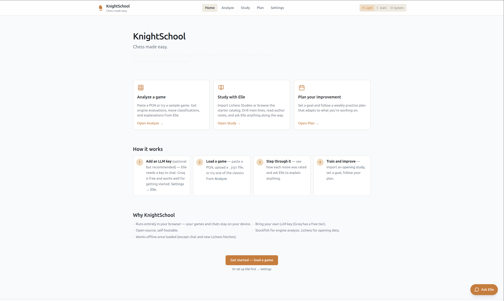
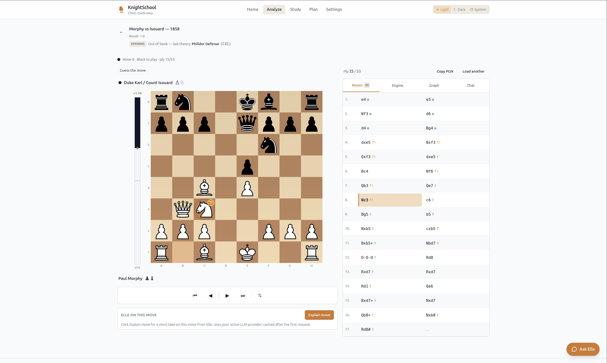
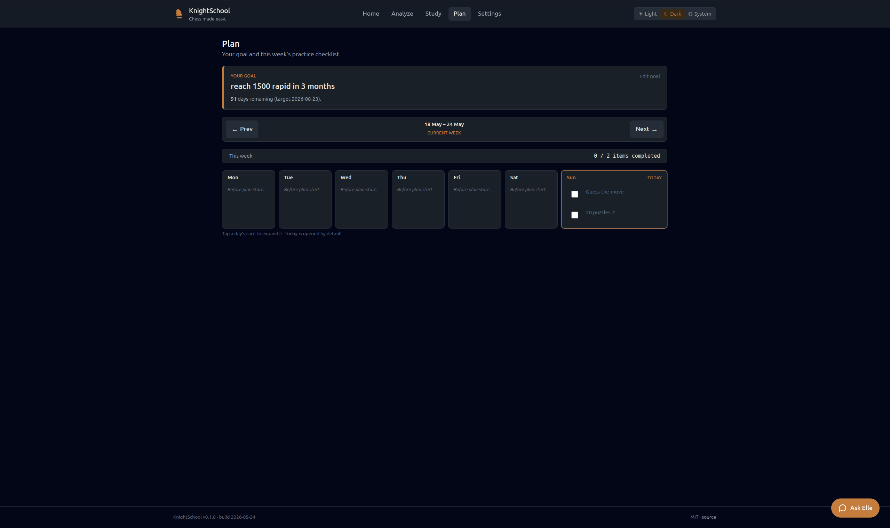
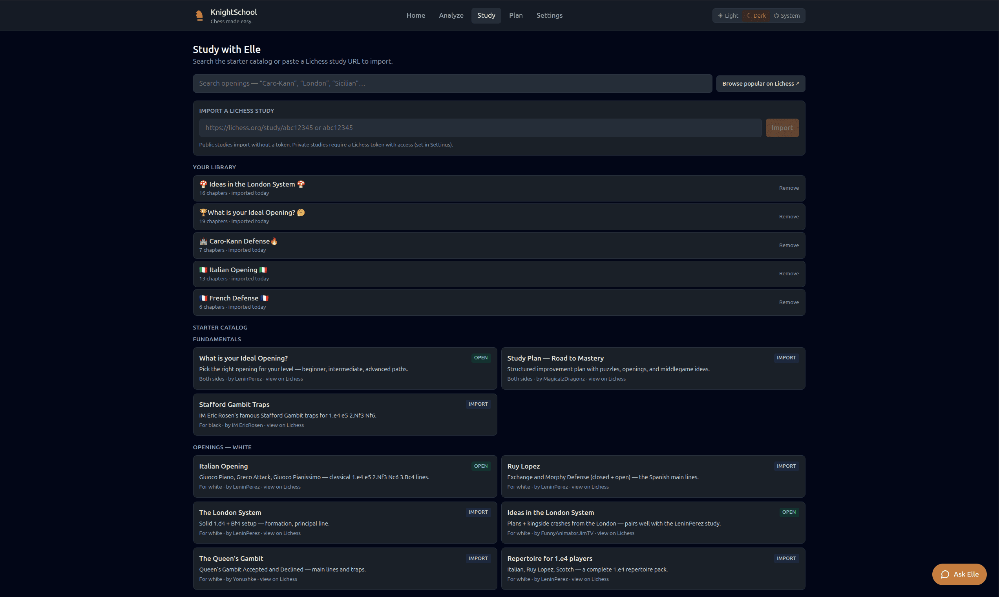
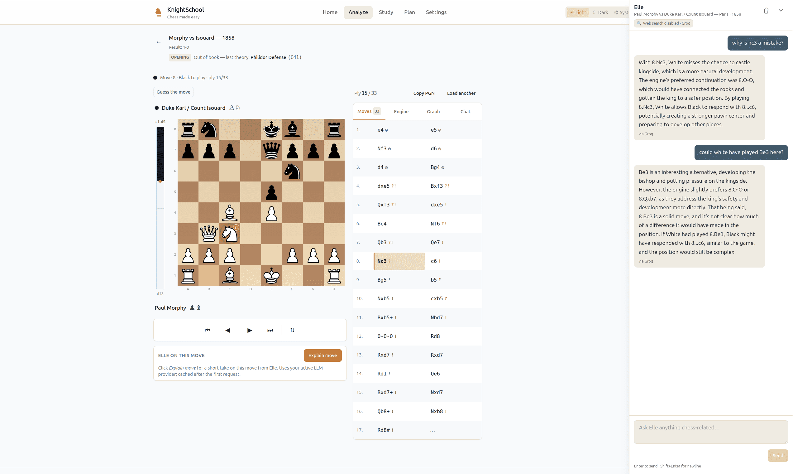
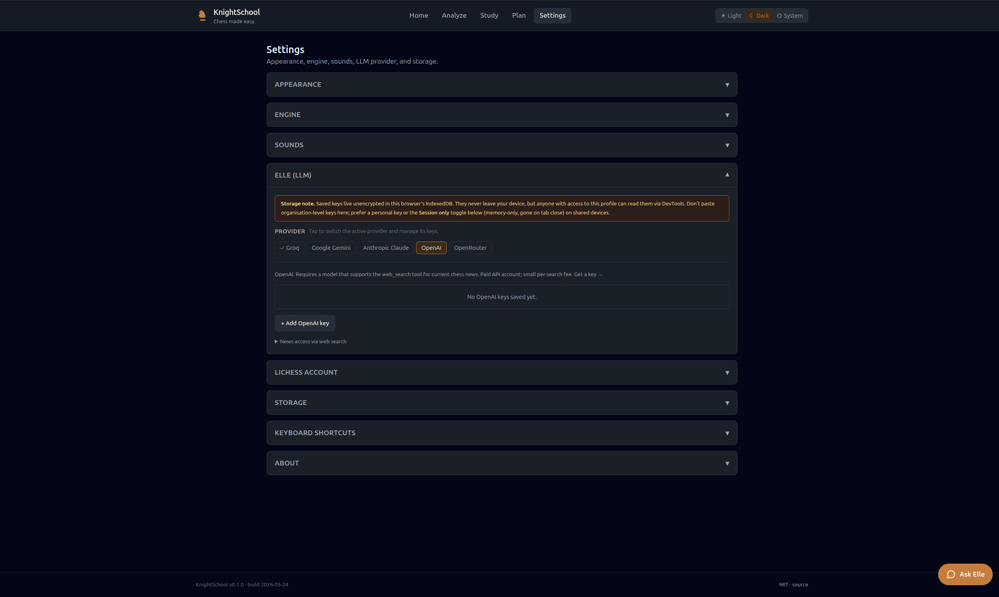

# KnightSchool

**Chess made easy.**

A client-side chess learning PWA. Analyze your own games with Stockfish, drill openings from real Lichess data, chat with **Elle** (an AI chess assistant), and follow a weekly practice plan toward a goal.

Everything runs in your browser - no backend, no auth, no telemetry. Bring your own LLM API key.

> **Status:** MVP feature-complete. [SPEC.md](./SPEC.md) is the canonical product + architecture spec.

## Screenshots













Light/dark pairs ship for landing, analyze, and chat (`*-dark.png`).
Capture brief: [`docs/screenshots/README.md`](docs/screenshots/README.md).

## What it does

- **Analyze** - Paste a PGN; get move-by-move Stockfish evaluation, top engine lines, classification (`best`, `good`, `inaccuracy`, `mistake`, `blunder`, `book`, `opening`), and an eval graph. Guess-the-move mode masks the next move and scores your accuracy.
- **Elle** - A friendly AI chess assistant. Comments on moves on demand, answers chess questions, and uses your provider's web search for current news. Drill-aware: opening chat mid-drill prompts an explicit invalidation modal.
- **Study** - Import Lichess Studies, drill chapter lines or mixed pools, pull master-game stats from the Lichess Opening Explorer when a token is configured.
- **Plan** - Set a goal in plain text; get a fixed weekly template (3 drills, 2 analyses, 1 lesson, 1 guess review, daily Lichess puzzle) with a daily checklist that rolls incomplete items forward to today.

## Privacy

Everything runs in your browser. Your games, your API key, your chat history - all stored locally in IndexedDB. The only external calls are to:

- Stockfish (local WASM, no network)
- Lichess APIs (`lichess.org`, `explorer.lichess.ovh`) for studies and explorer stats
- Your chosen LLM provider (Groq, Google Gemini, Anthropic, OpenAI, or OpenRouter) for Elle

No analytics, no telemetry, no third-party tracking.

## Self-hosting

Requires **Node 20 or newer** (an `.nvmrc` pins to 22 - `nvm use` picks it up). Node 18 will fail on the postinstall step + chessops imports.

```sh
git clone https://github.com/justagist/knight_school
cd knight_school
nvm use
npm install
npm run dev        # local dev at http://localhost:5173
```

Build and serve a static copy:

```sh
npm run build
npm run serve      # serves dist/ at http://localhost:8080 with COOP/COEP
```

No environment variables. No `.env` file. Bring your own LLM API key in the in-app Settings page. The local serve script does not set the strict CSP from `public/_headers` - that ships only via Cloudflare. See [DEVELOPMENT.md](./DEVELOPMENT.md) for the smoke-test recipe.

## Settings overview

- **Appearance** - Light / dark / system theme. Board theme + coordinate placement.
- **Engine** - Stockfish Lite (~6 MB, default) or Full (~40 MB, downloaded on demand). Analysis depth 10–30.
- **Sounds** - Move / capture / check / game-end. Off by default.
- **LLM (Elle)** - Provider (Groq / Gemini / Anthropic / OpenAI / OpenRouter), API key, model, test-connection button. Multiple keys per provider with auto-fallback on rate-limit. A **Session only** toggle keeps the key in memory and discards it on tab close - useful on shared devices.
- **Lichess** - Optional Lichess personal access token. Unlocks Opening Explorer enrichment + private Study imports.
- **Storage** - Used MB, export/import all data (with an "Include API keys" toggle that defaults OFF), clear everything.

## API keys

All credentials are stored locally in your browser. Nothing leaves your device except the actual provider calls.

### LLM (Elle)

Five providers are supported. Pick what fits your budget and feature needs.

- **Groq** - Free tier, no credit card. ~1,000 requests/day on Llama 3.3 70B. Strongest free option as of 2026. **No web search.** Get a key at [console.groq.com/keys](https://console.groq.com/keys).
- **Google Gemini** - Free tier with daily caps (slashed in 2026 - Flash ~20 RPD). Paid for higher quotas. Web search supported. Get a key at [aistudio.google.com](https://aistudio.google.com/app/apikey).
- **Anthropic Claude** - Paid only. Strongest reasoning. Web search supported on most current models, small per-search fee. Get a key at [console.anthropic.com](https://console.anthropic.com/settings/keys).
- **OpenAI** - Paid only. Web search supported on most current models via the Responses API, small per-search fee. Get a key at [platform.openai.com](https://platform.openai.com/api-keys).
- **OpenRouter** - Aggregator. ~50 requests/day free; rises to ~1,000/day after a one-time $10 top-up. Useful for accessing free-tier Llama / DeepSeek / Gemini variants without separate accounts. **No web search.** Get a key at [openrouter.ai/keys](https://openrouter.ai/keys).

> Free tier limits can change without notice - check the provider before relying on a quota.

**Choosing a provider:**

- Free, no card → **Groq** (best quota) or **Gemini** (cheapest path that also gives web search).
- Cheapest paid → **Gemini Flash-Lite** or **Anthropic Claude Haiku**.
- Need web search → **Anthropic, OpenAI, or Gemini**. Groq and OpenRouter don't expose a web-search tool; Elle's 🔎 toggle hides on those providers and the response comes from training knowledge only.

Multi-key support means you can stack a Groq free key as the daily driver and add a paid Anthropic / OpenAI key as the fallback for when you hit the free quota - switching happens automatically.

### Lichess (optional)

A Lichess personal access token unlocks the **Opening Explorer** (master-game stats, popular continuations, finer opening tags) and **Study import** features. Without a token the app still works - opening names come from the bundled ECO database (3,700+ positions), and the Openings tab still imports PGN you paste in.

To enable:

1. Sign in at [lichess.org](https://lichess.org/) and visit [account/oauth/token/create](https://lichess.org/account/oauth/token/create).
2. No scopes are required for the Explorer; leave them blank.
3. Copy the generated token.
4. In KnightSchool: **Settings → Lichess account → Add Lichess token**. Paste, save. The Settings UI validates the token immediately via `/api/account`.

The token is stored alongside your other data in IndexedDB. Exporting your backup with "Include API keys" enabled brings it along; without that toggle, it stays on the originating device.

> Lichess introduced auth on the Opening Explorer endpoint in 2026. The hybrid (bundled ECO + optional token) keeps the app fully usable for users who haven't created one.

## Drill modes

Three flavours of drill on the Study tab. They share one position index built per study on import, so a drill set up at study level still respects per-chapter cumulative stats.

- **Per-chapter (chapter)** - pick one chapter, play through its main line move by move. App plays the opponent's moves from the chapter; you play your side. A wrong move ends the run with the expected SAN + the chapter's author note. Use this when learning a specific line cold. Default when you tap `▶ Drill this chapter` from inside a chapter.
- **Mixed (free)** - pick All chapters / Pick chapters, free-drill mode, a length (10 / 25 / 50 / All). The engine drops you into a random chapter's starting position; you play your side, the engine plays the opponent's moves at random from the pool (weighted by occurrence count). When a line runs out, the engine teleports to a new chapter start so the drill keeps accumulating moves toward the target length. A wrong move ends the run. Use this when testing whether a repertoire stays in your head across multiple openings.

  The pool walks **every node** in every chapter's move tree - main line *and* variations - so the drill exercises the alternative responses the study author bothered to annotate, not just the headline line.
- **Spot drill** - same setup but `mode: spot`. The engine surfaces *critical* positions - FENs where, across the selected chapter scope, exactly one user-side move exists and the position is at least 3 plies deep. After each move a feedback card shows pass / fail; tap **Next spot** to advance. Use this when revising - you focus on the moves that actually require theory recall, not the obvious opening replies.

The setup modal is the same for all three. The "Drill" button at the top of the Study page opens it with mixed-mode defaults; the per-chapter `▶ Drill this chapter` button opens it with chapter-mode defaults. Either way, you can re-scope before clicking *Start drill*.

After a mixed / spot drill: the results card shows accuracy + per-chapter breakdown + a failure list with review links. A `Drill weak spots` CTA appears when at least one chapter scored below 70% and pre-selects those chapters for the next run.

A **practice queue** sits at the top of the Study tab - interleaves per-chapter drills (sorted by the failed → stale → review scheduler) with saved mixed/spot session configs. Tap × to remove a row from the queue.

## Plan

Set a free-text goal - "reach 1500 rapid in 3 months", "stop hanging pieces" - and the app pulls a target date out of obvious phrasing ("3 months", "by Aug 15") when it can. The Plan tab then renders a fixed weekly checklist:

- 3 drill sessions (Mon / Wed / Fri)
- 2 game analysis sessions (Tue / Thu)
- 1 study chapter to read (Sat)
- 1 guess-the-move review (Sun)
- A daily Lichess puzzle prompt on every day

Incomplete items roll forward into today's column with a `from <Day>` annotation. The original day's slot collapses to a muted `moved to today` placeholder so the same item never shows twice. Weekly reset happens on local Monday midnight; the previous week's checks stay in IndexedDB as audit history. Replacing the goal archives the old one - viewable under **Previous goals** (read-only).

## License

MIT - see [LICENSE](./LICENSE).
